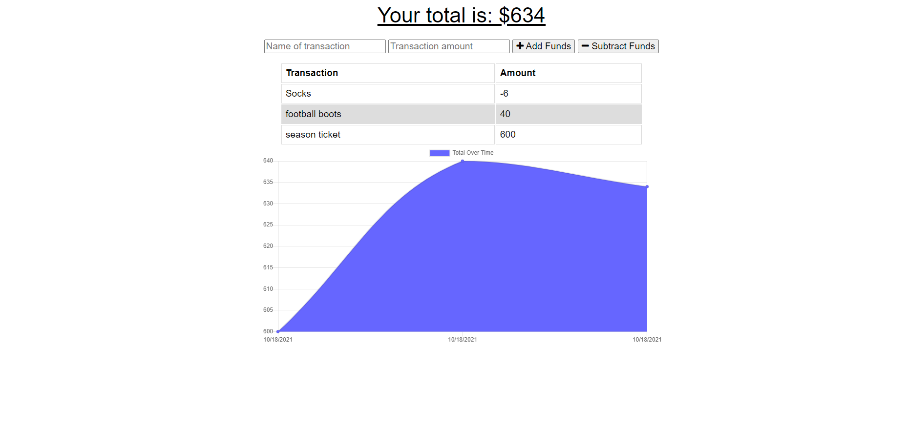

# Online-Offline-Budget-Trackers

## Description
This app is a Budget Tracker that works while online as well as should the user go offline. This app is released and available publically via a deployment to Heroku. The user will be able to add expenses and deposits to their budget with or without a connection. When entering transactions offline, they should populate the total when brought back online.

## Table of Contents
* Description
* User Story
* Business Context
* Acceptance Criteria
* Link to Online Offline Budget Tracker

## User Story
AS AN avid traveller I WANT to be able to track my withdrawals and deposits with or without a data/internet connection SO THAT my account balance is accurate when I am traveling

## Business Context
Giving users a fast and easy way to track their money is important, but allowing them to access that information anytime is even more important. Having offline functionality is paramount to our applications success.

## Acceptance Criteria
GIVEN a user is on Budget App without an internet connection WHEN the user inputs a withdrawal or deposit THEN that will be shown on the page, and added to their transaction history when their connection is back online.

## Deployed Link To Heroku and Repository
https://budget-trackers-odders17.herokuapp.com/

https://github.com/odders17/Online-Offline-Budget-Trackers

## Test out the app by loading the url and then:

* going offline, using Chrome's Developer Toolbar's (you may access this in by going in Chrome's 3 dots submenu item which is found all the way towards the right edge) Network tab where you change from "No throttling" to "Offline"

* then go to its Application tab and under Storage, you should be able to now twirl open (that is, click the arrow and it'll switch to a dropdown arrow), and then twirl open the "BudgetDB -https://budget-trackers-odders17.herokuapp.com " that appears and then select the "BudgetStore" item that appears there.

* on its panel that opens to the right, it is currently empty but once you now interact with the app by either entering a name of a transaction in its input field and a transaction amount and then clicking either "+Add Funds" or "-Subtrack Funds".

* at this point a "Data may be stale" notification will appear in the panel. Just click the circular refresh icon in the panel and you will see data on the transaction you entered stored.

* you may enter more transactions and just repeat step 5 to see the new transactions you entered.

* once you are ready (pretending to be back offline), return to the Network tab and change "Offline" selection back to "No throttling" and return to the Application tab and make sure you have the twirled BudgetDB database and its BudgetStore object selected.

* now, just click the circular refresh icon in the panel and you will see that transaction data that was stored is now no longer in this IndexedDB. The data has been uploaded to and now stored in the remote MongoDB.

